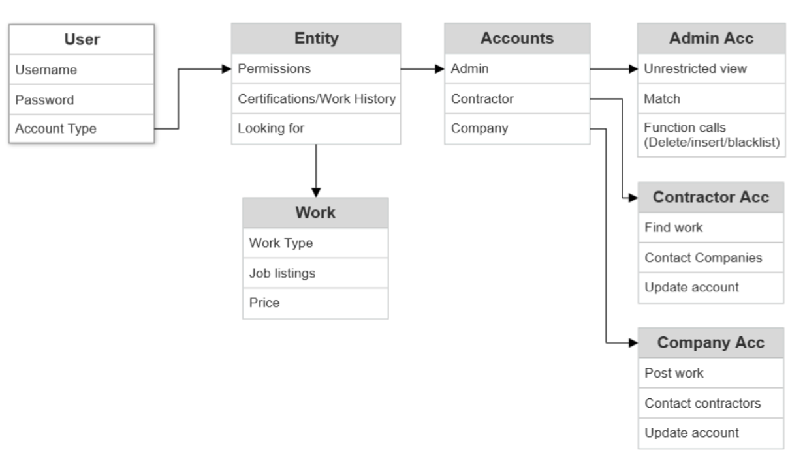
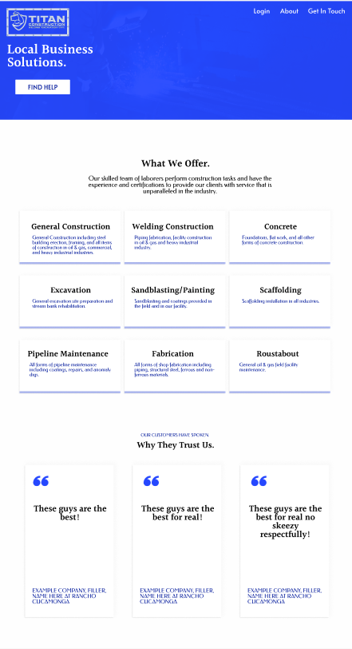
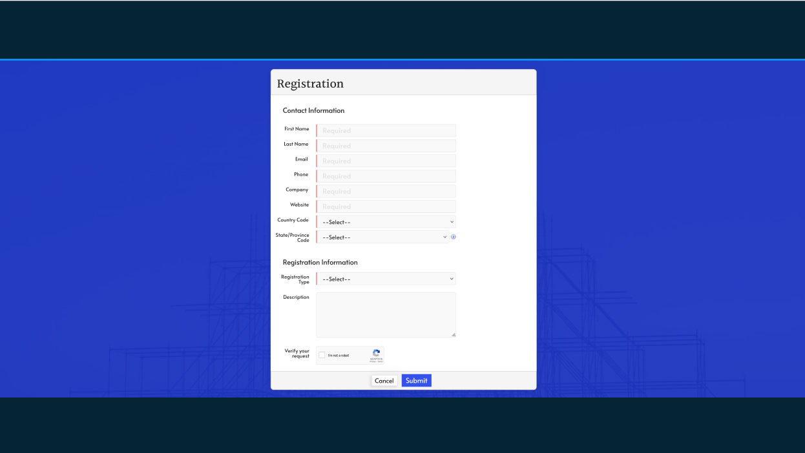
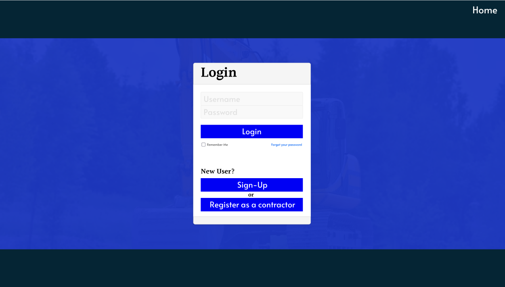
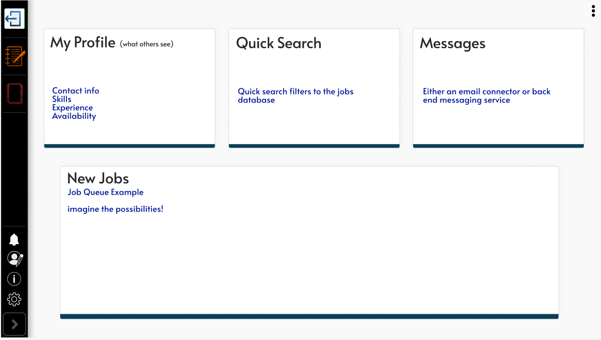
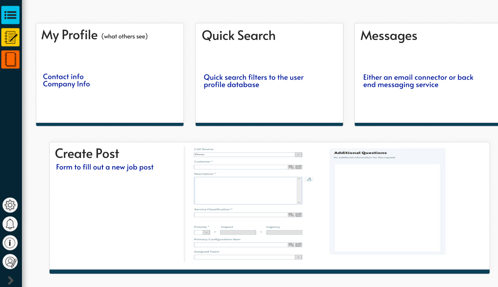
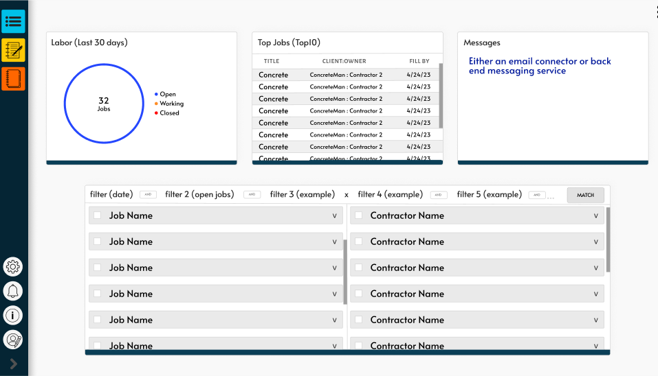

# Project Titan Finder by Team Lorem Ipsum

<!-- PROJECT SHIELDS -->
<!--ReadMe Template Credit: https://github.com/othneildrew/Best-README-Template/blob/master/README.md
*** Markdown "reference style" links for readability.
*** Reference links are enclosed in brackets [ ] instead of parentheses ( ).
*** See the bottom of this document for the declaration of the reference variables
*** for contributors-url, forks-url, etc. This is an optional, concise syntax you may use.
*** https://www.markdownguide.org/basic-syntax/#reference-style-links
-->
<!-- Must be enabled by git repo owner: 
[![Contributors][contributors-shield]][contributors-url] -->

<!-- PROJECT LOGO -->
<br />
<div align="center">
  <a href="https://github.com/Sarge02/Lorem-Ipsum">
    
  </a>

<h3 align="center">Titan Finder</h3>

  <p align="center">
    The purpose of this project is to build a website in which independent contractors working in construction can be matched with companies needing construction work done. The website would allow both the companies and the contractors to create accounts and submit work requests. The independent contractors would create a profile with their basic information, resume, and key skills. The companies will submit a work request form detailing the type of construction skills needed as well as other basic job information. The client will have administrative privileges to view the companies and contractors’ submissions, and then match accordingly. Key features of the website are its dashboard for all users which will easily display all actions one could take on the website, a messaging system for users to get in contact with one another once matched by the client, and a matching algorithm that allows contractors to be recommended for jobs automatically based upon their qualifications matching the companies job need.  
    <br />
    <br />
    <a href="https://github.com/Sarge02/Lorem-Ipsum"><strong>Explore the docs »</strong></a>
    <br />
    <br />
    <a href="https://github.com/Sarge02/Lorem-Ipsum">View Demo</a>
    
  </p>
</div>

<!-- TABLE OF CONTENTS -->
<details>
  <summary>Table of Contents</summary>
  <ol>
    <li>
      <a href="#about-the-project">About The Project</a>
      <ul>
        <li><a href="#features">Features</a></li>
        <li><a href="#built-with">Built With</a></li>
      </ul>
    </li>
    <li>
      <a href="#getting-started">Developer Instructions</a>
      <ul>
        <li><a href="#prerequisites">Prerequisites</a></li>
        <li><a href="#installation">Installation</a></li>
      </ul>
    </li>
    <li><a href="#deployment">Deployment</a></li>
    <li><a href="#timeline">Timeline & Milestones</a></li>
    <li><a href="#contact">Contact</a></li>
    <li><a href="#acknowledgments">Acknowledgments</a></li>
  </ol>
</details>
<br />

<!-- ABOUT THE PROJECT -->
## About The Project

<!--For when we have domain: [![Product Name Screen Shot][product-screenshot]](https://example.com) -->
<p> &nbsp &nbspThis platform will function as a mediator between employers and employees, allowing employers to request skilled tradesmen or entry-level laborers through the website. The platform will subsequently provide the employer with suitable candidates that match their requirements. </p>

<h3> How This Works:</h3>

<p>&nbsp &nbsp Unlike traditional job boards where employers post in search of employees and vice versa, Titan Finder will act as a middleman. Employers will come to the website and request a skilled tradesman or even an entry-level laborer. Titan Finder will then provide the employer with an employee that fits their needs. </p>

<div align="center">
   --------------------------Entity Relations Diagram (ERD)--------------------------<br />
  <br /><br />
  <br />
    --------------------------Prototype for the Home page-------------------------- <br />
  <br /><br />
  --------------------------Prototype for the Registration page--------------------------<br />
    <br /><br />
    --------------------------Prototype for the Login page-------------------------- <br />
    <br /><br />
    --------------------------Prototype for the independent contractor's dashboard page--------------------------<br />
    <br /><br />
    --------------------------Prototype for the companies dashboard page--------------------------<br />
    <br /><br />
    --------------------------Prototype for the admin dashboard page--------------------------<br />
    <br /><br />
  </div>
</div>


### Features
* Job Listings: Employers can submit job openings on your website, specifying the type of worker they need (skilled tradesman, entry-level laborer, etc.), the job location, and the duration of the job.
* Matching Algorithm: Your website can use a matching algorithm to suggest potential workers to employers based on their job requirements and the workers' profiles.
* Worker Profiles: Workers can create profiles on your website, including their skills, work experience, and availability.
* Communication Tools: Employers and workers can communicate through your website to discuss job details, schedule interviews, and negotiate terms.
* Job Board Management: As the middleman, you can manage the job board by reviewing job postings, verifying worker qualifications, and facilitating payments.
* Rating System: You could implement a rating system where employers can rate workers based on their performance, and workers can rate employers based on their job experience.
* Mobile Optimization: Your website should be optimized for mobile devices, making it easy for employers and workers to access and use on-the-go.


### Built With

* [![Bootstrap][Bootstrap.com]][Bootstrap-url]

<p align="right">(<a href="#project-titan-finder-by-team-lorem-ipsum">back to top</a>)</p>

<!-- Dev Instructions -->
## Developer Instructions

This is an example of how you may give instructions on setting up your project locally.
To get a local copy up and running follow these simple example steps.

<!-- ### Prerequisites This is an example of how to list things you need to use the software and how to install them. -->


### Installation

 Clone the repo
   ```sh
   git clone https://github.com/Sarge02/Lorem-Ipsum.git
   ```
<p align="right">(<a href="#project-titan-finder-by-team-lorem-ipsum">back to top</a>)</p>

<!-- Deployment -->
## Deployment

Instructions to be added in CSC 191 with the progression of this project.

<p align="right">(<a href="#project-titan-finder-by-team-lorem-ipsum">back to top</a>)</p>

<!-- Jira Timeline/Milestone -->
## Timeline

This is the general timeline of when tasks will be started. Ideally each task will be completed within its two week sprint deadline, however incomplete tasks will be continued in the next sprint. Our general timeline is as follows: 
-  Sprint 5: Login feature and user dashboard development
-  Sprint 6: User profile, Admin matching system
-  Sprint 7:Messaging center
-  Sprint 8: Matching algorithm

<p align="right">(<a href="#project-titan-finder-by-team-lorem-ipsum">back to top</a>)</p>

<!-- CONTACT -->
## Contact
  Developers: Megan Gross, Ryan Sarginson, Sameer Shaik, Christian Villagran, Rafael Mercado, Daniel Mason, Covi Singh, Illia Pashkovich

Project Link: [https://github.com/Sarge02/Lorem-Ipsum](https://github.com/Sarge02/Lorem-Ipsum)

<p align="right">(<a href="#project-titan-finder-by-team-lorem-ipsum">back to top</a>)</p>

<!-- ACKNOWLEDGMENTS -->
## Acknowledgments

* []() California State University, Sacramento | Engineering and Computer Science Department

<p align="right">(<a href="#project-titan-finder-by-team-lorem-ipsum">back to top</a>)</p>


<!-- MARKDOWN LINKS & IMAGES -->
<!-- https://www.markdownguide.org/basic-syntax/#reference-style-links -->
[contributors-shield]: https://img.shields.io/github/contributors/Sarge02/Lorem-Ipsum.svg?style=for-the-badge
[contributors-url]: https://github.com/Sarge02/Lorem-Ipsum/graphs/contributors
[Bootstrap.com]: https://img.shields.io/badge/Bootstrap-563D7C?style=for-the-badge&logo=bootstrap&logoColor=white
[Bootstrap-url]: https://getbootstrap.com
